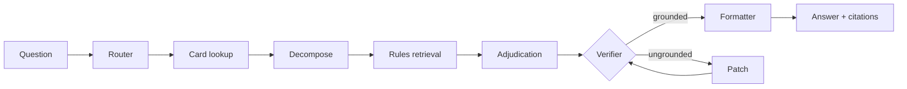

# Deckalization

**A Magic: The Gathering rules referee that shows its work.**

[deckalization.vercel.app](https://deckalization.vercel.app/) · [Live demo](https://deckalization.vercel.app/demo) · [Benchmarks](https://deckalization.vercel.app/benchmarks) · [Technical deep-dive](https://deckalization.vercel.app/technical)

Deckalization answers MTG rules questions with citations to the **Comprehensive Rules** and **Oracle card text**. It compares three answering architectures on a golden benchmark, measures them with six metrics, and lets you watch the winning agent reason through a question—node by node.

Ask *"I control X, my opponent does Y — what happens?"* and the system resolves card names to real Oracle text, retrieves the relevant rules, reasons through the interaction (stack, layers, state-based actions, replacement effects), and returns a ruling that cites both card text and rule numbers. A verifier loop rejects ungrounded claims.

---

## Results (bench40)

40 expert-curated rules questions, mostly from [RulesGuru](https://rulesguru.org), judged by an LLM against reference answers. Headline numbers from the pinned `bench40` suite (see [benchmarks](https://deckalization.vercel.app/benchmarks) for methodology).

| Metric | Zero-shot | RAG baseline | **Referee v2** |
| --- | ---: | ---: | ---: |
| **Correctness** | 0.24 | 0.58 | **0.70** |
| **Faithfulness** | — | 0.83 | **0.85** |
| **Rule recall** | — | 0.10 | **0.34** |
| Citation recall | 0.31 | 0.10 | 0.29 |
| Citation validity | 0.96 | 1.00 | 1.00 |

Referee v2 leads on every quality metric. Its standout advantage is **rule recall** (~3.5× RAG): query decomposition and cross-reference expansion pull the right Comprehensive Rules far more often than single-shot retrieval. Full scores, model sweeps, and metric definitions live on the [website](https://deckalization.vercel.app/technical) and in [`docs/eval-findings.md`](docs/eval-findings.md).

---

## Architectures

Three pipelines are compared end-to-end; a fourth (referee v1) is kept as an ablation.

| Pipeline | What it does |
| --- | --- |
| **Zero-shot** | One LLM call, no retrieval — the floor. |
| **RAG baseline** | Extract cards → resolve Oracle text → single semantic rules search → answer. Strong and cheap; the bar to beat. |
| **Referee v1** | Multi-agent graph with a verifier loop. Improved citations but *lost* correctness to plain RAG. |
| **Referee v2** | Production graph: router → card lookup → query decomposition → rules retrieval → two-stage adjudication → verifier (patch, not re-draft) → formatter. |

Four targeted fixes turned referee v2 from a deficit-vs-RAG into a decisive lead: generous card rulings in context, two-stage reason→format adjudication, verifier patches instead of full re-drafts, and decomposed rules retrieval with cross-reference expansion. See the [technical page](https://deckalization.vercel.app/technical) for the full story.



---

## Stack

| Layer | Choice |
| --- | --- |
| Orchestration | LangChain + LangGraph (Python) |
| Data layer | Convex (TypeScript) — card mirror + rules vectors |
| LLM gateway | OpenRouter (OpenAI-compatible), config-driven per node |
| Embeddings | OpenRouter `text-embedding-3-large` (3072-dim) |
| Observability + evals | LangSmith |
| Web UI | TanStack Start + shadcn/ui ([`app/deckalization-front-end/`](app/deckalization-front-end/)) |
| Tool interface | FastMCP server (dev / external clients only) |
| CI/CD | GitHub Actions |

---

## Guardrails

These are non-negotiable design constraints:

- **No row, no ruling** — card lookups return real DB rows or `not_found`; never answer from model memory alone.
- **MCP stays off the production hot path** — graph nodes call Convex tools directly.
- **Models are config-driven** — pinned in [`agents/core/config.py`](agents/core/config.py), never hardcoded in nodes.
- **Local mirror first** — all card lookups hit the Convex mirror; live Scryfall is fallback only.

---

## Repository layout

Canonical structure and conventions: [`AGENTS.md`](AGENTS.md).

```
deckalization/
├── agents/                 # Python — reasoning, orchestration, evals
│   ├── core/               # shared config, LLM, resolver, prompts, Convex tools
│   ├── baseline/           # zero-shot + single-chain RAG
│   ├── referee/            # multi-agent referee (v1 + v2 graphs, shared nodes)
│   ├── ingest/             # Comprehensive Rules download / parse / embed / seed
│   └── evals/              # benchmark suites, evaluators, LangSmith harness
├── convex/                 # TypeScript data layer (schema, queries, crons)
├── app/deckalization-front-end/  # website + live demo UI
├── mcp_server/             # FastMCP wrapper over core tools
├── docs/                   # eval findings & design notes
└── tests/
```

---

## Getting started

### Prerequisites

- [uv](https://docs.astral.sh/uv/) (Python 3.12)
- Node.js 18+ (Convex CLI + frontend)

### 1. Python environment

```bash
uv sync
```

### 2. Environment variables

```bash
cp .env.local.example .env.local
# Fill in OPENROUTER_API_KEY and LANGSMITH_API_KEY.
```

A single `.env.local` holds your secrets plus Convex-managed vars.

### 3. Convex

```bash
npx convex dev
# First run: browser login, creates deployment, writes CONVEX_* to .env.local.
```

### 4. Smoke test

```bash
uv run python -m agents.hello          # traced no-op graph + Convex ping
uv run pytest                          # unit tests (live tests self-skip without Convex)
npx @langchain/langgraph-cli dev       # serve graphs locally
```

### 5. Run a rules question

```bash
# Production referee (v2)
uv run python -m agents.referee.run --question "Does deathtouch work with trample?"

# Compare architectures on the same question
uv run python -m agents.baseline.run --baseline both --question "Does deathtouch work with trample?"
uv run python -m agents.referee.run --question "..." --compare

# Batch via fixture
uv run python -m agents.referee.run --fixture agents/evals/fixtures/sample_questions.jsonl
```

LangSmith traces: filter by `pipeline:referee` or tags `baseline:zero_shot` / `baseline:rag`.

### 6. Frontend (optional)

From [`app/deckalization-front-end/`](app/deckalization-front-end/):

```bash
pnpm install && pnpm dev
```

Set `VITE_CONVEX_URL` in the app's `.env`. Showcase replays work out of the box; live streaming needs `LANGGRAPH_DEPLOYMENT_URL` + `LANGSMITH_API_KEY` on the server (see the [frontend README](app/deckalization-front-end/README.md)).

---

## Evaluation harness

Evals are LangSmith experiments—the canonical numbers come from here, not one-off local runs.

```bash
# One-time dataset setup
uv run python -m agents.evals.scripts.ingest_rulesguru
uv run python -m agents.evals.scripts.build_benchmark_manifest

# Quick CI-sized sanity check (~15 cases)
uv run python -m agents.evals.run --suite smoke --target referee

# Headline comparison set (40 cases)
uv run python -m agents.evals.run --suite bench40 --compare baseline_rag referee_v2

# Full benchmark (~125 cases)
uv run python -m agents.evals.run --suite benchmark --compare zero_shot baseline_rag referee_v2
```

Pass/fail gates live in [`agents/evals/thresholds.yaml`](agents/evals/thresholds.yaml).

### CI / quality gate

| Workflow | Trigger | What it does |
| --- | --- | --- |
| [`ci.yml`](.github/workflows/ci.yml) | every push / PR | `ruff` + `mypy` + offline `pytest` (secret-free) |
| [`eval.yml`](.github/workflows/eval.yml) | manual dispatch | runs eval suite, uploads LangSmith experiment, fails on threshold miss |

Run the eval gate from **Actions → Eval gate → Run workflow** (defaults: `bench40`, referee vs RAG). Requires `OPENROUTER_API_KEY`, `LANGSMITH_API_KEY`, and prod `CONVEX_URL` as repository secrets.

---

## Environments

Same variable names everywhere; only values differ.

| Concern | Local dev | CI / prod |
| --- | --- | --- |
| OpenRouter key | `deckalization-dev` in `.env.local` | prod key as deployment / Actions secret |
| LangSmith project | `deckalization-dev` | `deckalization-ci` / `deckalization-prod` |
| Convex | personal dev deployment | prod deployment for eval gate |

---

## Attribution

Rules questions in the eval corpus are sourced from [RulesGuru](https://rulesguru.org) for non-commercial evaluation. Card data flows through Scryfall's API into a local mirror.
